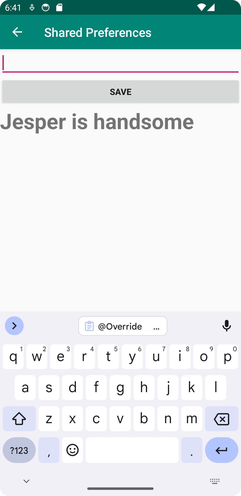

# Rapport
En ny screen skapades som kallades "mainactivity2" denna screen skulle då kunna bli öppnad utifrån orginal skärmen via en knapp "next page". 
En textview blev implementerad inom layouten för den första skärmen, denna view skulle ta emot värdet som skickats från den andra skärmen samt spara det.
För den andra skärmen "mainactivity2" så implementerades en edittext för inmatning av data, även en knapp för att kunna spara det som skrivits och efter skicka det till första skärmen, samt en textview för att se så datan som skrivits blev sparad.

```
MainActivity
private SharedPreferences myPreferenceRef;
private SharedPreferences.Editor myPreferenceEditor;
@Override
    protected void onCreate(...) {
    osv..
    
minBtn.setOnClickListener(new View.OnClickListener() {
            @Override
            public void onClick(View view) {
                Log.d("==>", "Button is working!");
                Intent intent = new Intent(MainActivity.this, Mainactivity2.class);
                startActivity(intent);
            }
        });
    }
    
    @Override
    protected void onResume (){
        super.onResume(); . . .
        
        myPreferenceRef = getSharedPreferences("MyPreferenceName", MODE_PRIVATE);
        myPreferenceEditor = myPreferenceRef.edit();
        
         // Display preferences
        TextView prefTextRef=new TextView(this);
        Log.d("Injera1", "" + myPreferenceRef.getString("MyAppPreferenceString", "No preference found."));
        prefTextRef=(TextView)findViewById(R.id.prefText);
        prefTextRef.setText(myPreferenceRef.getString("MyAppPreferenceString", "No preference found.")); . . .
        
        MainActivity2
    private SharedPreferences myPreferenceRef;
    private SharedPreferences.Editor myPreferenceEditor;
    
    @Override
    protected void onCreate(Bundle savedInstanceState) {
        super.onCreate(savedInstanceState);
        setContentView(R.layout.Activity_main2);
        myPreferenceRef = getSharedPreferences("MyPreferenceName",MODE_PRIVATE);
        myPreferenceEditor = myPreferenceRef.edit();
        
        TextView prefTextRef=new TextView(this);
        prefTextRef=(TextView)findViewById(R.id.prefText);
        prefTextRef.setText(myPreferenceRef.getString("MyAppPreferenceString", "No preference found."));
    }
    public void savePref(View v){
        // Get the text
        EditText newPrefText=new EditText(this);
        newPrefText=(EditText)findViewById(R.id.settingseditview);
        // Store the new preference
        myPreferenceEditor.putString("MyAppPreferenceString", newPrefText.getText().toString());
        myPreferenceEditor.apply();
...

 TextView prefTextRef=new TextView(this);
        prefTextRef=(TextView)findViewById(R.id.prefText);
        prefTextRef.setText(myPreferenceRef.getString("MyAppPreferenceString", "No preference found."));
        // Clear the EditText
        newPrefText.setText("");

    }
}
```




